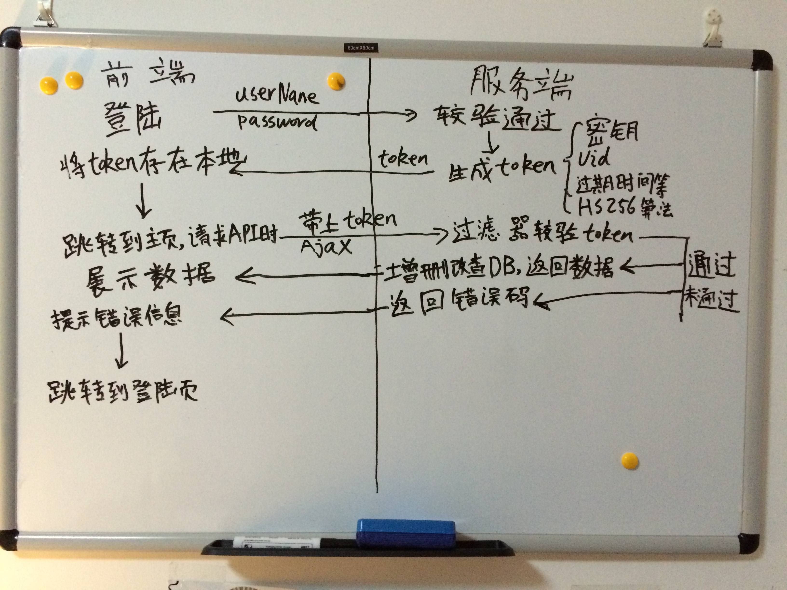

- 由于HTTP协议是无状态的协议，所以服务端需要记录用户的状态时，就需要用某种机制来识具体的用户，这个机制就是Session.典型的场景比如购物车，当你点击下单按钮时，由于HTTP协议无状态，所以并不知道是哪个用户操作的，所以服务端要为特定的用户创建了特定的Session，用用于标识这个用户，并且跟踪用户，这样才知道购物车里面有几本书。这个Session是保存在服务端的，有一个唯一标识。在服务端保存Session的方法很多，内存、数据库、文件都有。集群的时候也要考虑Session的转移，在大型的网站，一般会有专门的Session服务器集群，用来保存用户会话，这个时候 Session 信息都是放在内存的，使用一些缓存服务比如Memcached之类的来放 Session。
- 思考一下服务端如何识别特定的客户？这个时候Cookie就登场了。每次HTTP请求的时候，客户端都会发送相应的Cookie信息到服务端。实际上大多数的应用都是用 Cookie 来实现Session跟踪的，第一次创建Session的时候，服务端会在HTTP协议中告诉客户端，需要在 Cookie 里面记录一个Session ID，以后每次请求把这个会话ID发送到服务器，我就知道你是谁了。有人问，如果客户端的浏览器禁用了 Cookie 怎么办？一般这种情况下，会使用一种叫做URL重写的技术来进行会话跟踪，即每次HTTP交互，URL后面都会被附加上一个诸如 sid=xxxxx 这样的参数，服务端据此来识别用户。
- Cookie其实还可以用在一些方便用户的场景下，设想你某次登陆过一个网站，下次登录的时候不想再次输入账号了，怎么办？这个信息可以写到Cookie里面，访问网站的时候，网站页面的脚本可以读取这个信息，就自动帮你把用户名给填了，能够方便一下用户。这也是Cookie名称的由来，给用户的一点甜头。
#### 所以，总结一下：Session是在服务端保存的一个数据结构，用来跟踪用户的状态，这个数据可以保存在集群、数据库、文件中；Cookie是客户端保存用户信息的一种机制，用来记录用户的一些信息，也是实现Session的一种方式。

 - 用户输入的账号和密码提交给服务器；服务器对其进行校验，若账号和密码对得上则校验通过，说明登录成功。并生成一个token值，将其保存在数据库，同时也返回给客户端；
客户端拿到返回的token值后，可将其保存在本地。作为公共参数，即以后每次请求服务器时都携带该token，提交给服务器，让服务器校验。
服务器接收到请求后，会取出请求头里的token值与数据库存储的token进行对比校验。若两个token值相同，则说明用户登录成功过，且当前正处于登录状态，此时正常返回数据，让APP显示数据。若两个值不一致，则说明原来的的登录已经失效，此时返回错误状态码，提示用户跳转至登录界面重新登录。
